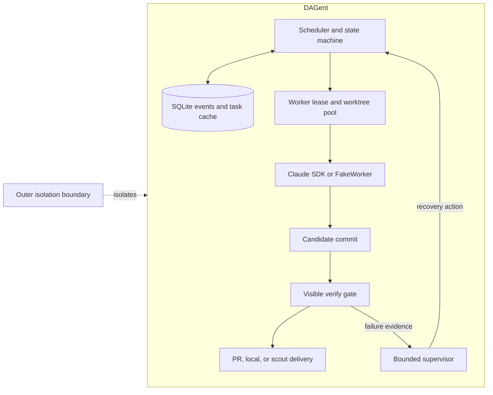

# DAGent

DAGent executes a dependency graph of coding tasks with one Claude Code worker
session per runnable node. The control plane is deterministic: an asyncio
scheduler, a state machine, and an append-only SQLite event log. Workers modify
code in isolated git worktrees.

The scheduler handles dependency settlement, concurrency, retries, stall
detection, verification, and delivery. A single-shot LLM supervisor is called
only after a failed or ambiguous attempt and must select from a closed recovery
action set. Successful tasks do not invoke it.

Evaluation methodology and current results are in
[BENCHMARK.md](BENCHMARK.md).

## Install

```bash
python -m venv .venv
source .venv/bin/activate
pip install -e ".[dev]"
```

Live workers require `claude-agent-sdk` and the same Claude Code credentials
used by the `claude` CLI.

Installed commands:

- `dagent`
- `dagent-verify-gate`
- `dagent-supervisor-replay`
- `dagent-experiment`
- `dagent-report`

## Create and run tasks

```bash
dagent add-task \
  --repo /path/to/target/repo \
  --title "Add input validation to parse_csv" \
  --brief "Raise ValueError for empty files and add a regression test." \
  --delivery-mode pr \
  --verify-cmd "pytest tests/test_csv_utils.py"
```

`add-task` returns a ULID. Repeatable `--depends-on <task_id>` options define
the DAG. A task remains `blocked` until all dependencies are delivered.
Missing dependencies and cycles are rejected before execution. If a dependency
cannot succeed, downstream tasks settle as `dependency_blocked` without
starting workers.

Repository paths may be registered as short names in a root-level
`repos.toml` file containing `name = "path"` entries.

Run a deterministic local simulation:

```bash
dagent run \
  --repo-root /path/to/target/repo \
  --fake-worker \
  --fake-supervisor
```

Run live workers only after declaring the isolation mode:

```bash
dagent run \
  --repo-root /path/to/target/repo \
  --external-isolation
```

`dagent run` exits after all tasks reach a resting or terminal state.
`dagent daemon` uses the same scheduler but continues polling the database for
new tasks.

Common options:

- `--max-concurrency N`: worker-slot and parallel-task limit; default 4.
- `--base-branch BRANCH`: attempt base; default `main`.
- `--worker-model` and `--supervisor-model`: model overrides.
- `--fake-worker` and `--fake-supervisor`: deterministic test doubles.
- `--yolo`: permit supervisor `abandon`; otherwise abandonment escalates.
- `--config path.toml`: configuration override.

## Status and escalation

```bash
dagent status
dagent status <task_id>
dagent status --digest
dagent answer <task_id> "use the production config"
```

`needs_human` tasks have no live worker. `answer` appends the response to the
brief and requeues a fresh attempt. A running `run` or `daemon` process detects
the change automatically.

Delivered artifacts are reported by `dagent status <task_id>`:

- `pr`: pull-request URL, branch, and commit SHA.
- `local`: exact before/after diff command.
- `scout`: `data/<task_id>/report.md`.

The latest committed candidate patch is retained at
`data/<task_id>/review.patch`. Pooled worktrees are temporary and should not be
used for review.

## Architecture



Workers produce candidate commits. The scheduler owns state transitions,
worker leases, recovery, and delivery. Candidate SHA and attempt lineage connect
execution, verification, supervisor decisions, delivery, and benchmark scoring.

### Event-sourced state

`events` is append-only. `tasks.state` is a derived cache. Each scheduler state
write emits `task.state_changed` in the same SQLite transaction with
`{from, to, cause_seq}`. CI verifies that replaying the event log reproduces
the task table.

Required invariants:

1. Only the scheduler writes `tasks.state`.
2. Each state write emits `task.state_changed` atomically.
3. `replay(events) == tasks`.
4. State changes record `{from, to, cause_seq}`.
5. The watchdog infers stalls from event silence; workers do not self-report
   stalls.
6. Retry and nudge limits are configuration, not prompt instructions.

### State machine

States: `blocked`, `queued`, `running`, `verifying`, `triage`, `needs_human`,
`delivering`, `delivered`, `failed`, `cancelled`, and `dependency_blocked`.

Terminal states are `delivered`, `failed`, `cancelled`, and
`dependency_blocked`. `needs_human` rests finite runs but remains recoverable
under `daemon`.

| From | To | Trigger |
|---|---|---|
| blocked | queued | all dependencies delivered |
| blocked | dependency_blocked | a required dependency cannot succeed |
| queued | running | scheduler acquired a slot and started a worker |
| running | verifying | worker produced a completion result |
| running | triage | stall, question, or unexpected exit |
| verifying | delivering | verification passed |
| verifying | triage | verification failed |
| triage | running | supervisor selected `nudge` or `restart` |
| triage | needs_human | supervisor selected `escalate` or retry budget ended |
| triage | failed | supervisor selected `abandon` in yolo mode |
| needs_human | queued | manager supplied an answer |
| delivering | delivered | delivery completed |
| delivering | triage | delivery failed |
| any | cancelled | manager cancelled the task |

A nonzero worker exit with retry budget remaining takes a deterministic direct
retry path and emits `recovery.policy_applied`. Startup, authentication, and
ambiguous failures enter supervisor triage.

### Supervisor

The supervisor receives one saved `TriagePacket` and returns one action:
`nudge`, `restart`, `wait`, `escalate`, or `abandon`. It has no tools, session,
memory, database access, or filesystem access. DAGent validates the action and
enforces retry and nudge limits.

Supervisor entry events are:

- `worker.stalled`
- `worker.asked`
- `worker.exited` without completion
- `verify.failed`
- `delivery.failed`

Saved packets can be replayed without rerunning a worker:

```bash
dagent-supervisor-replay \
  data/<task_id>/packets/<seq>.json \
  --model claude-sonnet-5
```

### Verify gate

The verify gate contains no LLM logic. It checks the candidate for a dirty
worktree and empty diff, exports the patch, materializes a disposable checkout,
runs the public verification command under a timeout, and reruns one failure to
identify flakes. Timeout cleanup terminates the full process group.

Result causes are `tests_passed`, `tests_failed`, `timeout`,
`candidate_checkout_failed`, `uncommitted_changes`, and `empty_diff`. Repeated
equivalent failures escalate instead of consuming the remaining retry budget.

Run the gate directly with:

```bash
dagent-verify-gate \
  --task <task_id> \
  --db data/dagent.db \
  --json \
  --record
```

### Workers and delivery

Each attempt runs one Agent SDK session in a pooled git worktree. SDK hooks and
structured messages become `worker.*` events. A task requires a clean worker
exit, a committed candidate or explicit no-change result, and passing public
verification. Missing optional completion metadata receives one bounded
corrective retry.

The worker process group is terminated and reaped before verification.
Teardown preserves the candidate ref, releases the worktree slot, and is
idempotent. Real and fake workers use the same JSON-lines protocol.

Delivery modes:

- `pr`: push the branch and open a pull request.
- `local`: fast-forward the local default branch.
- `scout`: write `data/<task_id>/report.md` without pushing.

`delivered` means the configured handoff completed; it does not mean a pull
request was merged.

## Recovery and persistence

State is stored in `data/dagent.db` by default. Restarting `run` or `daemon`
performs reconciliation before scheduling. Tasks left in `running` with dead
sessions receive a synthetic `worker.exited` event and enter normal recovery.
Worktree slots are reset before reuse.

## Security

DAGent does not sandbox live workers. Git worktrees isolate concurrent changes,
not workers from the host. SDK workers run in noninteractive
`bypassPermissions` mode.

Live execution requires one explicit declaration:

- `--external-isolation`: the caller provides a container or equivalent
  boundary.
- `--trusted-development`: intentional host execution; not valid for
  benchmarks.

Without either flag, live execution fails closed. Fake workers require neither.

Hidden tests and scoring run in a separate verifier environment. Their results
are not included in worker prompts, visible verification, or scheduler
decisions. Worker environment variables are passed to the child process but
are not stored in SQLite, events, logs, or artifacts. DAGent does not access the
macOS Keychain.

## Library use

```python
import asyncio
from functools import partial
from pathlib import Path

from dagent.scheduler import Scheduler
from dagent.store import connect, create_task
from dagent.supervisor import invoke_supervisor
from dagent.worker import spawn_sdk_worker

conn = connect("data/dagent.db")
create_task(
    conn,
    title="...",
    brief="...",
    repo="/path/to/repo",
    delivery_mode="pr",
    verify_cmd="pytest tests/",
)

scheduler = Scheduler(
    conn,
    repo_root="/path/to/repo",
    worktree_root=Path("data/worktrees"),
    spawn_worker=spawn_sdk_worker,
    worker_model="claude-sonnet-5",
    supervisor=partial(invoke_supervisor, model="claude-sonnet-5"),
)
asyncio.run(scheduler.run_until_settled())
```

The library constructor assumes the caller controls the execution environment.
It does not enforce the CLI isolation declaration. The default fake worker and
always-escalate supervisor provide deterministic local execution.

## Layout

```text
src/dagent/
  cli.py              CLI
  store/              SQLite events and derived task state
  scheduler/          State machine, event loop, watchdog
  worker/             SDK worker, FakeWorker, worktree pool
  verify/             Deterministic verification
  supervisor/         Triage packet and bounded action contract
  delivery/           PR, local, and scout delivery
  harbor.py           Outer-boundary adapter
  metrics.py          Experiment metrics
  policies.py         Benchmark policy selection
tests/scenarios/      FakeWorker regression scenarios
benchmarks/           Fixed benchmark package
harbor/               Isolated benchmark tracks
AGENTS.md             Repository-wide agent context
.claude/skills/       Topic-specific implementation reference
```

MIT licensed. See [LICENSE](LICENSE).
