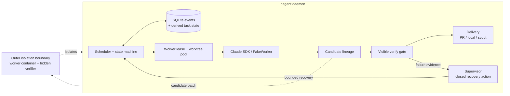

# DAGent

A DAG of coding tasks, an agent per node.

Run a team of Claude Code sessions in parallel from one process, without an LLM
in the control loop.

The premise: supervising a team of agents is a scheduling problem, not a
prompting problem.
So the control plane here is ordinary code - an asyncio scheduler, an
append-only SQLite event log, a state machine, a topological sort over a task
DAG - and LLM judgment is confined to the edges.
Workers are full Claude Code sessions in isolated git worktrees, and they are
the only things that write project code.
The single control-plane LLM call is a supervisor that triages a failed attempt
and returns one action from a closed enum.
Everything else - retries, nudges, stall detection, dependency settlement,
verification, delivery - is deterministic, replayable, and restart-proof.

Benchmarking, evaluation methodology, and measured results:
[BENCHMARK.md](BENCHMARK.md).

## Install

```bash
python -m venv .venv && source .venv/bin/activate
pip install -e ".[dev]"
```

Real worker sessions need `claude-agent-sdk` and whatever Claude Code auth your
environment already uses - the same credentials the `claude` CLI picks up.
This registers the `dagent`, `verify-gate`, `supervisor-replay`,
`dagent-experiment`, and `dagent-report` console scripts.

## Add a task

```bash
dagent add-task \
  --repo /path/to/target/repo \
  --title "Add input validation to parse_csv" \
  --brief "parse_csv() in src/csv_utils.py crashes on empty files. Raise a clear ValueError instead. Add a test." \
  --delivery-mode pr \
  --verify-cmd "pytest tests/test_csv_utils.py"
```

Prints the new task's ULID.
State lives in `data/dagent.db` unless you pass `--db`.

Chain tasks into a DAG with repeatable `--depends-on <task_id>`.
A task sits in `blocked` until every dependency reaches `delivered`; if a
prerequisite ends terminally unsuccessful, the dependent settles as
`dependency_blocked` without ever launching a worker.
Cycles and missing prerequisites fail closed, before any worker starts.

`--repo` also accepts a short name from `repos.toml` in the repo root - a flat,
hand-edited `name = "path"` table so you don't retype paths.
Anything not found there is used as a literal path.

## Run it

```bash
# Free, deterministic dry run: real worktrees, DAG resolution, verify gate and
# delivery, with scripted workers instead of live sessions.
dagent run --repo-root /path/to/target/repo --fake-worker --fake-supervisor

# Real sessions. Requires an explicit isolation declaration - see Security.
dagent run --repo-root /path/to/target/repo --external-isolation
```

`run` drives every task not already resting to `delivered` / `failed` /
`cancelled` / `dependency_blocked` / `needs_human`, then exits and prints a
status table.
It also streams one line to stdout the moment any task lands in `needs_human`,
`delivered`, or `failed`, so you can background it and tail the log rather than
polling `status`.

Useful flags:

- `--max-concurrency N` - worktree pool size and parallel task cap (default 4).
- `--base-branch BRANCH` - branch each attempt starts from (default `main`).
- `--worker-model` / `--supervisor-model` - override the `config.py` defaults.
- `--fake-worker` / `--fake-supervisor` - scripted worker, always-escalate
  supervisor. Free and deterministic.
- `--yolo` - let the supervisor `abandon` a task and auto-fail its dependents
  instead of always escalating to you.
- `--config path.toml` - override config defaults.

`dagent daemon` is the same thing that never exits: once everything
settles it keeps polling the SQLite file (`--poll-interval`, default 1s) for
newly added tasks, so an `add-task` from another terminal gets picked up
without a restart.
Ctrl-C tears down live workers cleanly.

Day-to-day this is meant to be driven in natural language from an agent session
that has this repo loaded - "queue a task to fix empty CSV imports", "start the
batch", "what's blocked?", "answer the URI task with option 2".
The agent translates that into these commands.
Raw invocation is for setup, debugging, and automation.

## When a task escalates

```bash
dagent status                 # every task and its state
dagent status <task_id>       # that task's escalation: summary, question, options
dagent status --digest        # terse: counts by state, open questions, session count
dagent answer <task_id> "use the prod config, not staging"
```

`answer` folds your message into the brief and requeues the task
(`needs_human -> queued`) for a fresh attempt.
By the time a task escalates its worker session is already gone - escalation
always tears the session down - so this is restart-with-feedback, not a live
nudge.
A `run` or `daemon` already watching that DB picks the task back up on its own.

## Reviewing delivered work

Don't go poking in the pooled worktree directories; they're scratch slots that
the scheduler wipes and reuses.
Review the delivered artifact recorded in events instead:

```bash
dagent status <task_id>
```

For `pr`, that prints the PR URL, branch, and commit SHA.
For `local`, it prints exact `git diff <before>..<after>` review commands.
For `scout`, read `data/<task_id>/report.md`.
The verify gate also leaves `data/<task_id>/review.patch` as a convenience copy
of the latest committed diff, so a patch survives worktree teardown.

If `run` or `daemon` dies, just run it again against the same DB.
Reconciliation happens at the top of every invocation: tasks stuck in `running`
with a dead session get a synthetic `worker.exited` and route through triage
like any other crash, and the worktree pool re-checks-out every slot
unconditionally.

## Architecture



The scheduler owns transitions and worker leases; workers only produce
candidates.
The candidate SHA and attempt lineage connect worker execution, verification,
recovery, delivery, and scoring without exposing hidden verifier data.

### Event-sourced state

`events` is an append-only table of facts; `tasks.state` is a derived cache.
Only the scheduler writes transitions, and every write emits
`task.state_changed` in the same SQLite transaction, carrying
`{from, to, cause_seq}` - the seq of the event that caused it.
That gives a full causality chain, and makes the whole system rebuildable from
its log: `replay(events) == tasks` is asserted in CI.

The invariants the tests enforce:

1. Only the scheduler writes `tasks.state`, and every write emits
   `task.state_changed` atomically with it.
2. The supervisor returns one action from a closed enum and never touches the
   database.
3. `replay(events) == tasks`.
4. State-change payloads carry `{from, to, cause_seq}`.
5. Stall is never self-reported - the watchdog derives `worker.stalled` from
   the absence of events past a threshold, rather than trusting a stuck worker
   to notice it is stuck.
6. Retry and nudge caps are orchestrator config, never prompt suggestions.

### State machine

States: `blocked`, `queued`, `running`, `verifying`, `triage`, `needs_human`,
`delivering`, `delivered`, `failed`, `cancelled`, `dependency_blocked`.
Terminal: `delivered`, `failed`, `cancelled`, `dependency_blocked`.
`needs_human` is a resting state for a finite batch, still recoverable under
`daemon`.

| From | To | Trigger |
|---|---|---|
| blocked | queued | all deps reached `delivered` |
| blocked | dependency_blocked | a required dep is terminal and cannot succeed |
| queued | running | scheduler acquired slot + worktree, spawned session |
| running | verifying | `worker.done_claimed` |
| running | triage | `worker.stalled` \| `worker.asked` \| `worker.exited` without done-claim |
| verifying | delivering | `verify.passed` |
| verifying | triage | `verify.failed` |
| triage | running | supervisor `nudge` (same session) or `restart` (new session, retries += 1) |
| triage | needs_human | supervisor `escalate`, or retries exhausted |
| triage | failed | supervisor `abandon` - yolo mode only |
| needs_human | queued | manager answered; requeued with the answer folded into the brief |
| delivering | delivered | PR opened / local ff-merge done / scout report written |
| delivering | triage | push rejected, merge conflict |
| any | cancelled | manager kills the task |

Every exception path funnels through `triage`.
`delivered` means the artifact was handed off, not merged - merging is the
manager's call.
A non-zero worker exit with retry budget remaining takes a deterministic fast
path: record `recovery.policy_applied` and retry through the ordinary
candidate-lineage path, with no LLM triage call at all.
Startup, authentication, and ambiguous failures still go through the
supervisor.

### The supervisor

One function, one contract: packet in, action out, no side effects.
A single Messages API call - no tools, no session, no memory - which makes it
stateless and therefore replayable.
Every packet is dumped to disk, so prompts and models can be re-run offline
against saved packets with `supervisor-replay`.

It is invoked at exactly five triage-entry events: `worker.stalled`,
`worker.asked`, `worker.exited` without a done-claim, `verify.failed`, and
`delivery.failed`.
Happy-path completions never touch it; the verify gate is the judge of "done".

The packet carries the brief, repo, delivery mode, verify command, the trigger,
verify output, event history, a transcript tail, and the remaining nudge/retry
budget.
Deliberately excluded: team state, filesystem access, evaluator-only
configuration, and memory.

The response union is closed - `nudge`, `restart`, `wait`, `escalate`,
`abandon` - and the orchestrator computes which of those are actually allowed
and enforces the caps itself.
A validation failure falls back visibly to human escalation.

### The verify gate

Deterministic, with no LLM and no evaluator-only logic.
It turns a worker's committed candidate into public evidence: a pass/fail with
a typed cause, a normalized failure signature, and a patch.

Execution order is dirty-worktree and empty-diff checks, patch export,
materializing the durable candidate in a disposable internal checkout,
running the public command under a timeout, then rerunning a single failure to
identify flakes.
Timeout cleanup kills the check's whole process group.

Causes are `tests_passed`, `tests_failed`, `timeout`,
`candidate_checkout_failed`, `uncommitted_changes`, and `empty_diff`, and each
maps to a supervisor heuristic - `uncommitted_changes` nudges, `empty_diff`
restarts with a pointed commit reminder, equivalent repeated failure signatures
escalate rather than burning retries on the same wall.

### Workers and delivery

One Agent SDK session per task, cwd set to a pooled internal git worktree.
Hooks and structured result messages map to `worker.*` events; session end maps
to `worker.exited`.
The SDK's `ResultMessage` is authoritative for completion - the
`DONE_CLAIM`/`ASK`/`NO_CHANGE` lines are optional protocol metadata, and a
completion still requires a clean exit, a committed candidate (or an explicit
no-change), and public verification.
Missing metadata is recorded as `protocol_incomplete` and gets at most one
bounded corrective retry.

A done claim is followed by process-group termination and reaping before the
candidate is verified.
Teardown is idempotent: it closes child transports, releases the worktree slot,
and preserves the candidate ref.
Real and fake workers share a JSON-lines protocol, so the FakeWorker scenario
suite in `tests/scenarios/` exercises the same paths as a live run.

Delivery mode is per task and explicit:

- `pr` - push the branch and open a PR via `gh`; delivered means PR open.
- `local` - approved fast-forward merge into the local default branch.
- `scout` - never pushes; writes `data/<task_id>/report.md`. For investigation
  tasks, or dry runs against a repo you don't want touched.

Delivery failures route through supervisor triage like anything else.

## Security

This project does not sandbox a live Claude worker and does not protect the
host filesystem from one.
Its git worktrees isolate concurrent edits from each other, not workers from
the host.
SDK workers run in Claude Code's non-interactive `bypassPermissions` mode
because the orchestrator has no approval-prompt channel; that is a convenience
setting, not a boundary.

Real workers therefore require an explicit declaration at the call site:
`--external-isolation` asserts that the caller has already placed the process
inside a container or other trusted outer environment, and
`--trusted-development` is an intentional direct-host development run that is
never a benchmark path.
Without one of the two, a real run fails closed.
Fake workers need neither.

Hidden tests and scoring belong in a separate verifier environment, and hidden
results never enter the agent environment.
Visible verification is public worker feedback only: it runs against
agent-visible repository state and inherits the worker environment.
Caller-supplied worker environment variables may contain credentials; they are
used only for the child process and are never persisted to SQLite, events,
logs, or artifacts.
DAGent never accesses the macOS Keychain.

## Using it as a library

The CLI is a thin wrapper over `Scheduler` and `create_task`:

```python
import asyncio
from functools import partial
from pathlib import Path

from dagent.store import connect, create_task
from dagent.scheduler import Scheduler
from dagent.worker import spawn_sdk_worker
from dagent.supervisor import invoke_supervisor

conn = connect("data/dagent.db")
task_id = create_task(conn, title="...", brief="...", repo="/path/to/repo",
                      delivery_mode="pr", verify_cmd="pytest tests/")

scheduler = Scheduler(conn, repo_root="/path/to/repo",
                      worktree_root=Path("data/worktrees"),
                      spawn_worker=spawn_sdk_worker, worker_model="claude-sonnet-5",
                      supervisor=partial(invoke_supervisor, model="claude-sonnet-5"))
asyncio.run(scheduler.run_until_settled())                # like `dagent run`
# asyncio.run(scheduler.run_until_settled(forever=True))  # like `dagent daemon`
```

This low-level constructor is for code that already controls its execution
environment; it does not enforce the isolation declaration the CLI does.
The `Scheduler` defaults (`spawn_fake_worker`, `always_escalate`) give the same
free deterministic dry run as `--fake-worker --fake-supervisor`.

## Layout

    src/dagent/
      cli.py              `dagent` console script
      store/              SQLite: events (append-only facts) + tasks (derived)
      scheduler/          state machine, asyncio loop, watchdog
      worker/             Agent SDK sessions, FakeWorker, worktree pool
      verify/             deterministic verify gate + standalone CLI
      supervisor/         TriagePacket -> single LLM call -> closed action enum
      delivery/           pr | local | scout
      harbor.py           outer-boundary adapter
      metrics.py          durable experiment metrics
      policies.py         policy selection for experiments
    tests/scenarios/      FakeWorker scenario suite = regression suite
    bench/, benchmarks/, harbor/   benchmark inputs, profiles, and tracks
    AGENTS.md             repo context loaded into every agent session
    .claude/skills/       topic deep reference, loaded on demand

## License

MIT - see [LICENSE](LICENSE).
